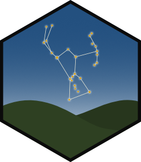
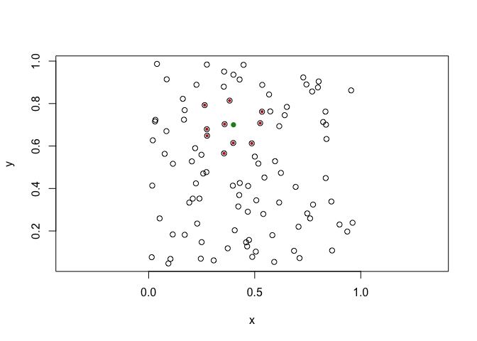
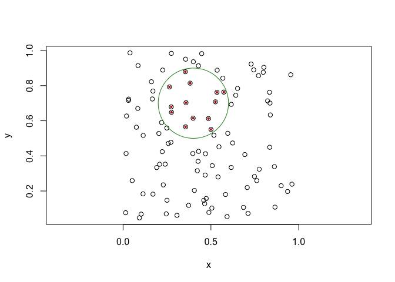

<!-- README.md is generated from README.Rmd. Please edit that file -->

# orion 

<!-- badges: start -->

[](https://lifecycle.r-lib.org/articles/stages.html#experimental)
[](https://CRAN.R-project.org/package=boundaries)
[](https://app.codecov.io/gh/thomasp85/orion?branch=main)
[](https://github.com/thomasp85/orion/actions/workflows/R-CMD-check.yaml)
<!-- badges: end -->

orion provides spatial searching to the euclid ecosystem. It does this
through a kd tree that supports both nearest/furthest neighbor as well
as range queries.

## Installation

You can install the development version of orion like so:

``` r
devtools::install_github("thomasp85/orion")
```

## Example

A search always start by creating a kd tree, which can be created from
2D and 3D points. You can provide a range of different strategies for
how it should be created but here we are just using the defaults.

``` r
library(euclid)
#> 
#> Attaching package: 'euclid'
#> The following object is masked from 'package:stats':
#> 
#>     line
#> The following object is masked from 'package:base':
#> 
#>     union
library(orion)

pts <- point(runif(100), runif(100))
tree <- kd_tree(pts)
tree
#> <2D kd tree [100]>
#> Tree constructed using the sliding midpoint strategy
#>  - bucket size: 10
```

Now you can use this tree for various queries. All of these are
vectorised on the queries so the same tree can be queried efficiently
multiple times.

Below is shown a standard nearest neighbor search for the 10 closest
neighbors to the input:

``` r
pt <- point(0.4, 0.7)
neighbors <- kd_tree_search(pt, tree, n = 10)
plot(pts, cex = 1)
euclid_plot(neighbors$points, cex = 0.6, pch = 16, col = 'firebrick')
euclid_plot(pt, cex = 1, pch = 16, col = 'forestgreen')
```



You can also do range queries (ie. return all points inside a geometry):

``` r
circ <- circle(pt, 0.04)
inside <- kd_tree_range(circ, tree)
plot(pts, cex = 1)
euclid_plot(inside$points, cex = 0.6, pch = 16, col = 'firebrick')
euclid_plot(circ, fg = 'forestgreen')
```



This is the basics — it is a very focused package. There is a bit more
to it but this should be obvious from the docs.

## Benchmark

The advantages of using a kd tree over a naive approach.

``` r
naive_search <- function(query, points, n) {
  d <- distance_squared(query, points)
  points[order(d)[seq_len(n)]]
}

lookup <- point(runif(1e4), runif(1e4))
query <- point(0.5, 0.5)
tree <- kd_tree(lookup)

bench::mark(
  naive               = naive_search(query, lookup, 10),
  kd_tree_precomputed = kd_tree_search(query, tree, 10),
  kd_tree_tree_build  = kd_tree_search(query, kd_tree(lookup), 10),
  iterations = 100,
  check = FALSE
)
#> # A tibble: 3 × 6
#>   expression               min   median `itr/sec` mem_alloc `gc/sec`
#>   <bch:expr>          <bch:tm> <bch:tm>     <dbl> <bch:byt>    <dbl>
#> 1 naive                 2.04ms   2.11ms     448.      114KB      0  
#> 2 kd_tree_precomputed  99.47µs 103.98µs    9496.         0B     95.9
#> 3 kd_tree_tree_build   28.24ms  28.59ms      34.9        0B      0
```

We can see that the construction of the tree makes the kd tree based
search slower than a single naive search, but a tree can be reused for
multiple queries making it a good approach for most practical
applications

## Code of Conduct

Please note that the orion project is released with a [Contributor Code
of
Conduct](https://contributor-covenant.org/version/2/1/CODE_OF_CONDUCT.html).
By contributing to this project, you agree to abide by its terms.
